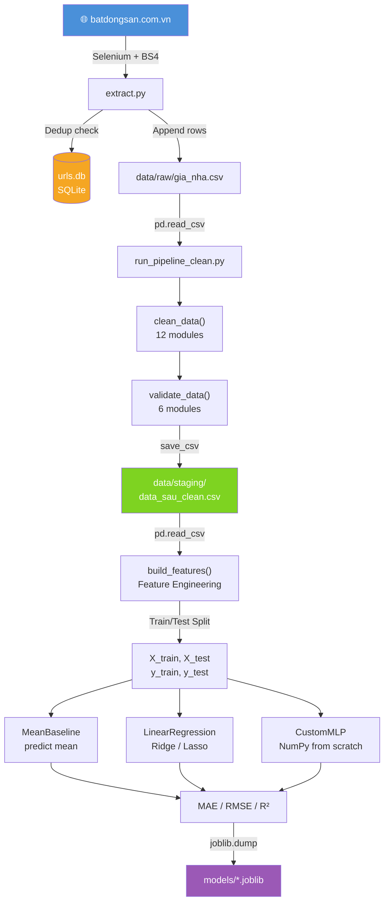

# 🏠 Phân Tích Dự Án `project_price`

---

## 1. Tổng Quan Dự Án

### Mục tiêu
Dự án xây dựng một **hệ thống end-to-end dự đoán giá bất động sản** tại Việt Nam, gồm 3 giai đoạn chính:
1. **Thu thập dữ liệu** (Web Scraping từ batdongsan.com.vn)
2. **Xử lý & làm sạch dữ liệu** (ETL Pipeline)
3. **Huấn luyện mô hình ML** để dự đoán giá nhà / cho thuê

### Bài toán giải quyết
> **Bài toán Regression**: Dự đoán giá nhà/đất từ các đặc trưng như diện tích, số phòng, vị trí, pháp lý...

### Công nghệ chính
| Công nghệ | Vai trò |
|---|---|
| **Python** | Ngôn ngữ lập trình chính |
| **Selenium + BeautifulSoup** | Web Scraping tự động |
| **Pandas / NumPy** | Xử lý dữ liệu |
| **Scikit-learn** | Linear models, preprocessing |
| **Custom NumPy MLP** | Mạng nơ-ron viết tay bằng NumPy |
| **SQLite (urls.db)** | Lưu URL đã crawl, tránh trùng lặp |
| **YAML** | Cấu hình hệ thống |
| **Joblib** | Lưu & load model |
| **Matplotlib** | Vẽ biểu đồ phân tích |

---

## 2. Cấu Trúc Thư Mục

```
project_price/
├── config.yaml               ← Cấu hình crawl (trang bắt đầu, kết thúc, batch size, DB creds)
├── requirements.txt          ← Danh sách thư viện Python
├── run_pipeline_clean.py     ← ENTRY POINT: chạy pipeline Clean + Validate
├── urls.db                   ← SQLite DB lưu URL đã crawl (55MB - rất nhiều dữ liệu!)
│
├── src/                      ← Source code chính
│   ├── config/               ← Config cho model training
│   │   ├── default.yaml      ← Cấu hình mặc định (MLP + features)
│   │   └── benmark.yaml      ← Các kịch bản benchmark (preprocessing × models)
│   │
│   ├── data/                 ← Toàn bộ xử lý dữ liệu
│   │   ├── etl/
│   │   │   └── extract.py    ← Web scraping batdongsan.com.vn
│   │   ├── clean/            ← ~12 module làm sạch từng trường dữ liệu
│   │   │   ├── clean_data.py ← Orchestrator gọi tất cả clean modules
│   │   │   ├── clean_price.py, clean_area.py, clean_floor.py, ...
│   │   ├── validate/         ← Kiểm định dữ liệu sau clean
│   │   │   ├── validate_data.py  ← Orchestrator validate
│   │   │   ├── validate_price.py, validate_area.py, ...
│   │   └── analysis_pipeline.py  ← EDA: vẽ biểu đồ phân phối, log-transform
│   │
│   ├── features/
│   │   └── build_feature.py  ← Feature Engineering (time features, OHE, scaling, log-target)
│   │
│   ├── models/               ← Định nghĩa các mô hình
│   │   ├── baseline.py       ← MeanBaseline (predict trung bình)
│   │   ├── linear.py         ← LinearRegression, Ridge, Lasso
│   │   ├── custom_mlp.py     ← MLP viết tay bằng NumPy (Adam, Dropout, Early Stopping)
│   │   ├── tree.py           ← Tree-based models (Decision Tree / Random Forest)
│   │   └── customMLP_*.py    ← Các biến thể MLP (Smooth, Wide)
│   │
│   ├── pipelines/            ← Training pipelines
│   │   ├── train_baseline.py ← Train MeanBaseline
│   │   ├── train_linear.py   ← Train Linear/Ridge/Lasso
│   │   ├── train_tree.py     ← Train Tree models
│   │   └── train_mlp.py      ← Train Custom MLP (với Train/Val/Test split)
│   │
│   └── utils/                ← Tiện ích dùng chung
│       ├── logger.py         ← Custom Logger (ghi file + console)
│       ├── io.py             ← Load/Save CSV, Pickle
│       ├── metrics.py        ← MAE, RMSE, R² evaluation
│       └── timer.py          ← Đo thời gian chạy
│
├── data/
│   ├── raw/gia_nha.csv       ← Dữ liệu thô sau crawl
│   └── staging/              ← Dữ liệu sau clean, sẵn sàng cho training
│
├── models/                   ← Model files (.joblib) lưu sau training
├── logs/                     ← Log files tự động (theo timestamp)
├── reports/                  ← Biểu đồ EDA, kết quả phân tích
└── notebooks/                ← Jupyter notebooks thử nghiệm ban đầu
```

---

## 3. Luồng Hoạt Động Của Chương Trình

### Bước 1 — Thu Thập Dữ Liệu (ETL Extract)
```
python src/data/etl/extract.py
```
Chương trình bắt đầu từ hàm `extract()`:
1. Khởi tạo SQLite DB (`urls.db`) để track URL đã crawl
2. Duyệt qua batdongsan.com.vn từ `START_PAGE` → `END_PAGE` (theo batch)
3. Mỗi batch: crawl danh sách link → lọc link mới → crawl chi tiết bài đăng → lưu CSV
4. Dùng `ThreadPoolExecutor(5 workers)` để crawl song song (nhanh hơn 5x)
5. Nghỉ ngẫu nhiên 5-15 giây giữa các batch (tránh bị block)

### Bước 2 — Làm Sạch & Kiểm Định (Clean + Validate)
```
python run_pipeline_clean.py
```
1. Đọc `data/raw/gia_nha.csv`
2. Chạy `clean_data()`: chuẩn hóa từng trường (giá, diện tích, tầng, phòng ngủ...)
3. Chạy `validate_data()`: loại bỏ dữ liệu ngoài range hợp lệ, đổi tên cột sang tiếng Anh
4. Lưu kết quả `data/staging/data_sau_clean.csv`

### Bước 3 — Huấn Luyện Mô Hình (Training)
```
python src/pipelines/train_linear.py   # hoặc train_mlp.py / train_baseline.py
```
1. Đọc staging data
2. Feature engineering (`build_features`)
3. Train model, đánh giá (MAE, RMSE, R²)
4. Lưu model vào `models/`

---

## 4. Phân Tích Chi Tiết Code

### 📁 `src/data/etl/extract.py` — Web Scraper
| Hàm | Mô tả |
|---|---|
| `create_driver()` | Khởi tạo Chrome driver, dùng profile thật (tránh bot detection) |
| `crawl_all_listing_urls()` | Lấy tất cả link bài đăng từ nhiều trang |
| `parse_listing_info()` | Scrapt thông tin chi tiết 1 bài: giá, diện tích, số phòng, địa chỉ... |
| `scrape_details()` | Multi-threaded scraping (5 workers song song) |
| `save_to_csv()` | Append data vào CSV (không ghi đè, thêm vào cuối file) |
| `init_db() / is_new_url() / save_new_url()` | SQLite để deduplication URL |
| `filter_new_links()` | Lọc ra chỉ các URL chưa crawl |
| `extract()` | **Main function** — orchestrates toàn bộ quy trình |

**Điểm đặc biệt**: Dùng SQLite `urls.db` (55MB!) làm bộ nhớ URL đã crawl → có thể resume crawl nếu bị crash mà không crawl lại từ đầu.

---

### 📁 `src/data/clean/` — Data Cleaning Modules
`clean_data.py` gọi tuần tự các hàm:

| Hàm | File | Mô tả |
|---|---|---|
| `loai_hinh_dat()` | `clean_transaction.py` | Chuẩn hóa loại giao dịch (mua/bán/thuê) |
| `dien_tich()` | `clean_area.py` | Parse diện tích (m²) từ chuỗi như "50 m²" |
| `muc_gia()` | `clean_price.py` | Parse giá (tỷ/triệu → số thực) |
| `so_phong_ngu()` | `clean_bedroom.py` | Parse số phòng ngủ |
| `so_tang()` | `clean_floor.py` | Parse số tầng |
| `so_phong_tam()` | `clean_bathroom.py` | Parse số phòng tắm |
| `mat_tien()` | `clean_facade.py` | Parse mặt tiền (m) |
| `duong_vao()` | `clean_entrance.py` | Parse đường vào (m) |
| `ngay_dang()` | `posted_date.py` | Parse ngày đăng |
| `crawl_date()` | `crawl_date.py` | Chuẩn hóa ngày crawl |
| `xoa_trung_lap()` | `duplicates.py` | Xóa bản ghi trùng hoàn toàn |
| `xoa_trung_lap_theo_cot()` | `duplicates__column.py` | Xóa trùng theo subset cột |
| `xoa_giao_dich_cho_thue()` | `clean_transaction.py` | Lọc bỏ dữ liệu cho thuê |

---

### 📁 `src/data/validate/` — Data Validation
`validate_data.py` gọi tuần tự:

| Hàm | Mô tả |
|---|---|
| `validate_area()` | Loại bỏ diện tích = 0 hoặc quá lớn/nhỏ bất thường |
| `validate_price()` | Loại bỏ giá = 0 hoặc outlier |
| `validate_location()` | Kiểm tra thành phố/quận huyện hợp lệ |
| `rename_columns()` | Đổi tên cột sang tiếng Anh (Mức giá → price, Diện tích → area...) |
| `xoa_cot_null_nhieu()` | Xóa cột có tỷ lệ null cao |
| `clean_missing_values()` | Xử lý giá trị thiếu còn lại |

---

### 📁 `src/features/build_feature.py` — Feature Engineering
Pipeline 8 bước chuyên nghiệp:
1. **Train/Test Split** (80/20, stratified random)
2. **Time Features**: `posted_year`, `days_on_market`, cyclic encoding sin/cos cho tháng và ngày trong tuần
3. **Categorical Features**: OHE cho `city`, `district`, `property_type`, `transaction_type`, `legal_status`
4. **Numerical Features**: tự động detect `int64/float64`
5. **Log Transform**: áp dụng `log1p()` cho các cột skewed
6. **StandardScaler**: chuẩn hóa numerical features
7. **Target Normalization**: `log1p(price)` + `StandardScaler`
8. **Return**: dict gồm X_train, X_test, scalers, encoders

> 💡 **Điểm hay**: Cyclic encoding (`sin/cos`) cho tháng và thứ trong tuần là best practice trong ML — tránh mô hình nghĩ tháng 12 và tháng 1 "xa nhau".

---

### 📁 `src/models/custom_mlp.py` — Mạng Nơ-Ron Viết Tay
`CustomMLP` được xây dựng **hoàn toàn bằng NumPy** (không dùng TensorFlow/PyTorch) với đầy đủ:
- **Forward pass**: ReLU activation, Dropout (inverted)
- **Backward pass**: Gradient Descent thủ công
- **Adam Optimizer**: với bias correction (β₁=0.9, β₂=0.999)
- **L2 Regularization**: weight decay
- **Gradient Clipping**: clip gradient [-5, 5]
- **Early Stopping**: dừng nếu val_loss không cải thiện sau `patience` epochs
- **Learning Rate Decay**: giảm LR khi plateau

Architecture mặc định: `Input → 256 → 128 → 64 → 1` với Dropout=0.2, L2=1e-4

---

### 📁 `src/utils/`
| File | Mô tả |
|---|---|
| `logger.py` | Custom Logger: ghi log ra console + file trong `logs/` với timestamp tự động |
| `io.py` | `load_csv`, `save_csv`, `save_pickle`, `load_pickle` |
| `metrics.py` | `evaluate_regression()` → MAE, RMSE, R² |
| `timer.py` | Context manager đo thời gian |

---

## 5. Kiến Trúc Hệ Thống

```
┌──────────────────────────────────────────────────────────────────────┐
│                    ETL LAYER (Data Ingestion)                        │
│  batdongsan.com.vn → Selenium/BS4 → urls.db (dedup) → CSV (raw)     │
└───────────────────────────────┬──────────────────────────────────────┘
                                │
┌───────────────────────────────▼──────────────────────────────────────┐
│                  TRANSFORM LAYER (Clean + Validate)                  │
│  raw CSV → 12 Clean Modules → 6 Validate Modules → staging CSV       │
└───────────────────────────────┬──────────────────────────────────────┘
                                │
┌───────────────────────────────▼──────────────────────────────────────┐
│               FEATURE ENGINEERING (build_feature.py)                 │
│  staging CSV → Time feats → OHE → Log1p → StandardScaler → X, y     │
└─────────────┬─────────────────┬───────────────────┬──────────────────┘
              │                 │                   │
    ┌─────────▼──────┐  ┌───────▼──────┐  ┌────────▼───────┐
    │  MeanBaseline  │  │ Linear/Ridge │  │  Custom MLP    │
    │  (Baseline)    │  │  /Lasso      │  │  (NumPy)       │
    └─────────┬──────┘  └───────┬──────┘  └────────┬───────┘
              └─────────────────┴──────────────────-┘
                                │
                       ┌────────▼────────┐
                       │  models/*.joblib│
                       │  MAE/RMSE/R²    │
                       └─────────────────┘
```

**Pattern kiến trúc**: **ETL Pipeline → Feature Pipeline → ML Pipeline** (ML Pipeline tương tự Scikit-learn `Pipeline` nhưng viết thủ công).

---

## 6. Thư Viện Và Dependency

| Thư viện | Vai trò |
|---|---|
| `selenium` | Điều khiển Chrome browser để crawl dynamic website (JS rendering) |
| `beautifulsoup4` | Parse HTML, extract thông tin từ trang web |
| `webdriver-manager` | Tự động download đúng version ChromeDriver |
| `pandas` | Xử lý DataFrame, đọc/ghi CSV |
| `numpy` | Tính toán ma trận, implement MLP từ scratch |
| `scikit-learn` | LinearRegression, Ridge, Lasso, StandardScaler, OneHotEncoder, metrics |
| `matplotlib` | Vẽ biểu đồ phân phối (EDA) |
| `PyYAML` | Đọc file `.yaml` (config) |
| `joblib` | Lưu/load model ML nhanh hơn pickle |
| `tensorflow` | Có trong requirements nhưng **không được dùng** trong code hiện tại |

---

## 7. README.md Dự Án

```markdown
# 🏠 Vietnam Real Estate Price Prediction

Hệ thống end-to-end dự đoán giá bất động sản Việt Nam bao gồm:
web scraping → data cleaning → machine learning.

## Tính năng
- Thu thập dữ liệu tự động từ batdongsan.com.vn (multi-threaded)
- Loại bỏ URL trùng lặp thông qua SQLite
- Pipeline làm sạch dữ liệu modular (12+ cleaning modules)
- Feature engineering đầy đủ (cyclic encoding, log transform, OHE)
- Mạng nơ-ron MLP tự xây dựng bằng NumPy thuần (không framework)
- So sánh nhiều mô hình: Baseline → Linear → MLP

## Cài đặt
pip install -r requirements.txt

## Chạy
# 1. Thu thập dữ liệu
python src/data/etl/extract.py

# 2. Làm sạch dữ liệu  
python run_pipeline_clean.py

# 3. Training
python src/pipelines/train_linear.py
python src/pipelines/train_mlp.py

## Cấu trúc
data/raw/ → data/staging/ → models/
```

---

## 8. Sơ Đồ Luồng Hệ Thống



---

## 9. Đề Xuất Cải Thiện

### 🔧 Clean Code

| Vấn đề | Giải pháp |
|---|---|
| `train_mlp.py` có cả code cũ bị comment và code mới | Xóa phần commented-out, dùng git history |
| `Logger` custom thay vì dùng `logging` chuẩn | Migrate sang Python `logging` module (đã làm 1 phần ở `run_pipeline_clean.py`) |
| `config.yaml` chứa mật khẩu DB plaintext | Dùng `.env` + `python-dotenv` |
| Hardcode paths như `"data/raw/gia_nha.csv"` ở nhiều nơi | Tập trung paths vào 1 file `src/config/paths.py` |

### 🏗️ Cải Thiện Kiến Trúc

| Vấn đề | Giải pháp |
|---|---|
| Không có script master để chạy toàn bộ pipeline | Tạo `main.py` hoặc `Makefile` |
| `build_feature.py` không support save/load scaler | Lưu `scaler_X`, `ohe` vào `models/` để dùng khi predict |
| Không có script inference/prediction | Thêm `predict.py` nhận input và trả về giá dự đoán |
| `benmark.yaml` có typo (benchmark → benmark) | Sửa thành `benchmark.yaml` |
| `tensorflow` trong requirements nhưng không dùng | Xóa hoặc implement TensorFlow version đễ so sánh |

### ⚡ Tối Ưu Hiệu Năng

| Vấn đề | Giải pháp |
|---|---|
| Crawl dùng `ThreadPoolExecutor` nhưng mỗi URL tạo 1 Chrome instance | Dùng `aiohttp` + `asyncio` hoặc headless Playwright |
| `CustomMLP` chỉ dùng NumPy CPU | Thử xem TensorFlow/PyTorch version có cải thiện không |
| Không có cross-validation | Thêm K-Fold CV cho đánh giá honest hơn |
| Không track experiments | Thêm `MLflow` hoặc `Weights & Biases` để log metrics |

### 📊 Cải Thiện ML

```python
# Thêm các mô hình mạnh hơn
from sklearn.ensemble import GradientBoostingRegressor
import xgboost as xgb
import lightgbm as lgb

# Thêm Hyperparameter Tuning
from sklearn.model_selection import GridSearchCV

# Thêm Feature Selection
from sklearn.feature_selection import SelectKBest, f_regression
```
